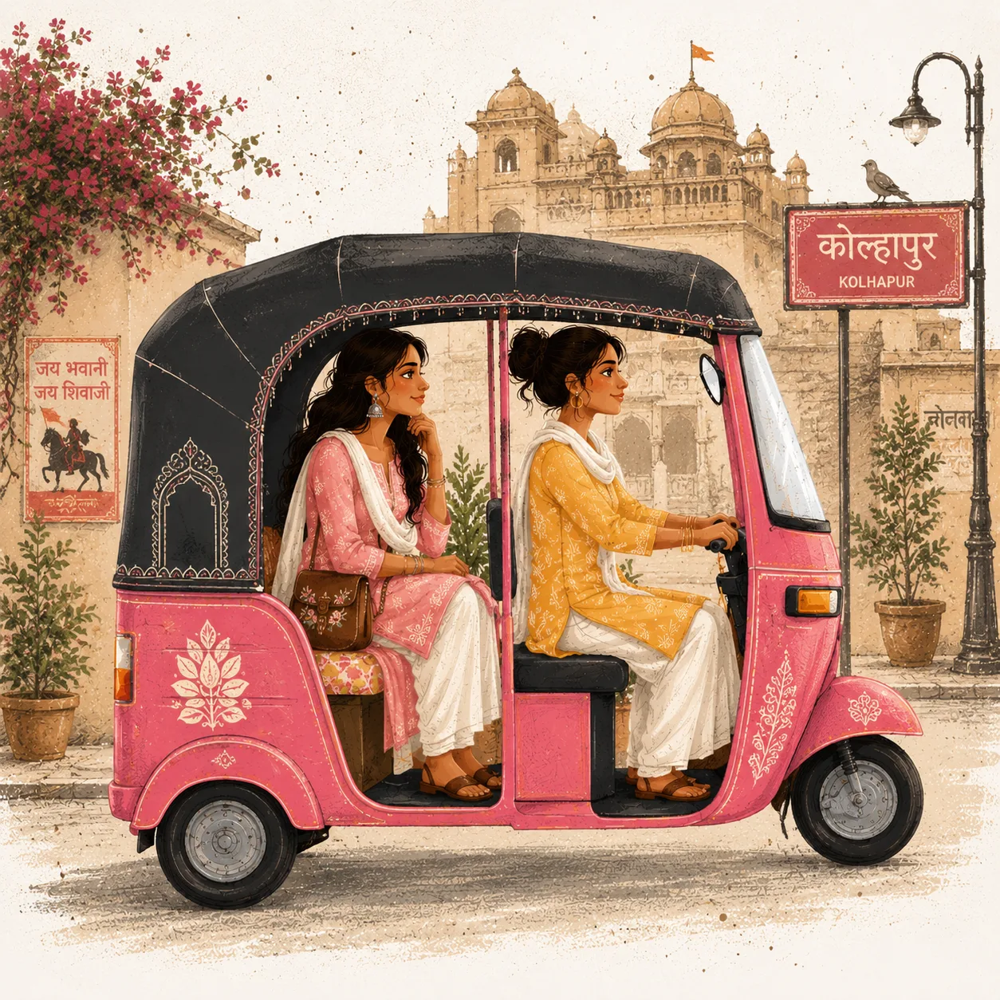
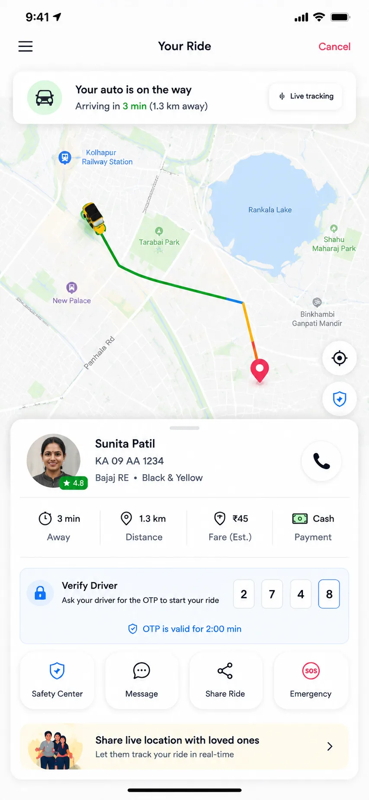

<div align="center">


# Pink Auto · Website

**Safe, reliable auto rides for women, students & families**

[](https://react.dev/)
[](https://www.typescriptlang.org/)
[](https://vitejs.dev/)
[](https://tailwindcss.com/)

*Women-driven autos · GPS tracking · SOS support · 24×7 help*

[Live site](https://adityaxdeore.github.io/Pink-Auto-Website/) · [Report issue](https://github.com/AdityaxDeore/Pink-Auto-Website/issues)

</div>

---

<br />



<br />

## About

**Pink Auto** is the marketing website for a women-focused transportation service in **Maharashtra**. The site introduces the brand, services, safety features, coverage map, driver onboarding, and contact options — with a cinematic scroll intro, mobile-first layouts, and WhatsApp booking flows.

> *Driven by Women, Trusted by Families*  
> *Comfort · Safety · Empowerment*

---

## Highlights

| Feature | Description |
|--------|-------------|
| **Cinematic intro** | GSAP scroll scene with 3D phone mockup and app screenshot |
| **Women-first services** | Dedicated ride types, safety section, and driver recruitment |
| **Live map** | OpenStreetMap coverage for active service areas |
| **Mobile UX** | Auto-scrolling service cards with manual swipe on phone |
| **Performance** | WebP images, lazy-loaded sections, manual vendor chunks |
| **WhatsApp CTAs** | One-tap book & driver registration links |

---

## Screenshots

<table>
  <tr>
    <td width="50%">
      
      <p align="center"><sub><b>Hero</b> — brand story & download CTAs</sub></p>
    </td>
    <td width="50%">
      
      <p align="center"><sub><b>Intro scroll</b> — live app UI in phone frame</sub></p>
    </td>
  </tr>
  <tr>
    <td width="50%">
      
      <p align="center"><sub><b>Services</b> — women-only & local rides</sub></p>
    </td>
    <td width="50%">
      
      <p align="center"><sub><b>Support</b> — round-the-clock assistance</sub></p>
    </td>
  </tr>
</table>

---

## Tech stack

| Layer | Tools |
|-------|--------|
| **Framework** | React 18 + TypeScript |
| **Build** | Vite 6 |
| **Styling** | Tailwind CSS 4, custom design tokens |
| **Animation** | GSAP + ScrollTrigger, Framer Motion |
| **Maps** | Leaflet + OpenStreetMap |
| **Icons** | Lucide React |
| **Images** | Sharp (WebP optimization script) |

---

## Getting started

### Prerequisites

- **Node.js** 18+  
- **npm** 9+

### Install & run

```bash
git clone https://github.com/AdityaxDeore/Pink-Auto-Website.git
cd Pink-Auto-Website
npm install
npm run dev
```

Open **http://localhost:5173** — scroll through the cinematic intro, then explore the main site.

### Production build

```bash
npm run build
npm run preview
```

### Optimize images

After updating source PNGs in `src/assets/`:

```bash
npm run optimize-images
```

Outputs compressed WebP files to `public/images/`.

---

## Project structure

```
├── public/
│   ├── images/          # Optimized WebP & JPG assets
│   └── logo.png
├── scripts/
│   └── optimize-images.mjs
├── src/
│   ├── assets/          # Source images (build-time imports)
│   ├── components/
│   │   ├── layout/      # Navbar, Footer
│   │   └── ui/          # Hero, cards, map, marquee, etc.
│   ├── lib/             # Site config, media URLs, utils
│   └── pages/
│       └── Home.tsx     # Main landing page
└── vite.config.ts
```

---

## Configuration

Edit brand copy and contact details in `src/lib/site-config.ts`:

```ts
export const SITE = {
  name: "Pink Auto",
  tagline: "Safe & Reliable Auto Service for Women",
  location: "Maharashtra",
  phone: "+91 98765 43210",
  whatsapp: "919876543210",
  email: "hello@pinkauto.in",
  // ...
}
```

---

## Scripts

| Command | Description |
|---------|-------------|
| `npm run dev` | Start dev server |
| `npm run build` | Type-check + production build |
| `npm run build:pages` | Production build for GitHub Pages (`/Pink-Auto-Website/` base) |
| `npm run preview` | Preview production build |
| `npm run optimize-images` | Compress assets to WebP |
| `npm run lint` | Run ESLint |

---

## Deployment

This site is a **Vite SPA** with a **scroll-pinned GSAP intro** followed by the main landing page.

### Flow on production

1. **Intro** — cinematic scroll scene (GSAP ScrollTrigger pin)
2. **Enter site** — skip button or scroll to ~98% completes intro
3. **Main site** — navbar, sections, maps, and CTAs mount with scroll reset to top

### GitHub Pages (recommended)

**Live URL:** [https://adityaxdeore.github.io/Pink-Auto-Website/](https://adityaxdeore.github.io/Pink-Auto-Website/)

Pushes to `master` deploy automatically via [`.github/workflows/deploy-pages.yml`](.github/workflows/deploy-pages.yml).

**One-time repo setup:**

1. Open **Settings → Pages** on [AdityaxDeore/Pink-Auto-Website](https://github.com/AdityaxDeore/Pink-Auto-Website)
2. Under **Build and deployment**, set **Source** to **GitHub Actions**
3. Push to `master` (or run the workflow manually under **Actions**)

**Local Pages build preview:**

```bash
npm run build:pages
npm run preview
```

The Pages build uses base path `/Pink-Auto-Website/` (repo name). A `404.html` copy of `index.html` is generated for client-side routing.

### Vercel (optional)

1. Import the repo at [vercel.com/new](https://vercel.com/new)
2. Build command: `npm run build` (not `build:pages` — Vercel uses `/` base)
3. Output directory: `dist`

`vercel.json` includes SPA rewrites and cache headers for `/assets` and `/images`.

---

## Contact

| | |
|---|---|
| **Location** | Rajarampuri, Maharashtra 416008 |
| **Phone** | +91 98765 43210 |
| **Email** | hello@pinkauto.in |
| **WhatsApp** | Book or driver enquiries via on-site buttons |

---

<div align="center">

**Pink Auto** · Maharashtra

*Empowering women on every ride*

</div>